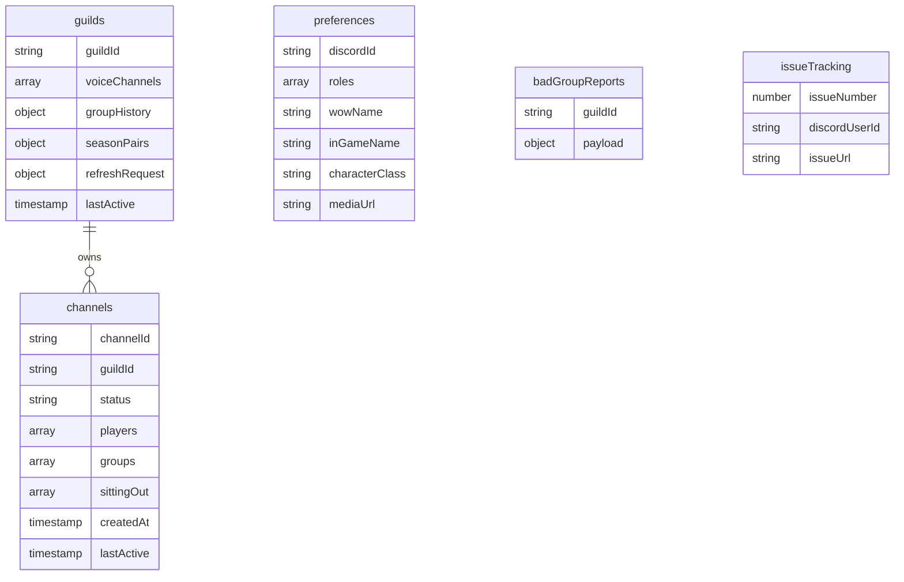
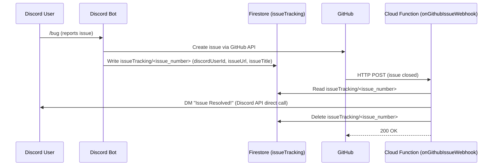
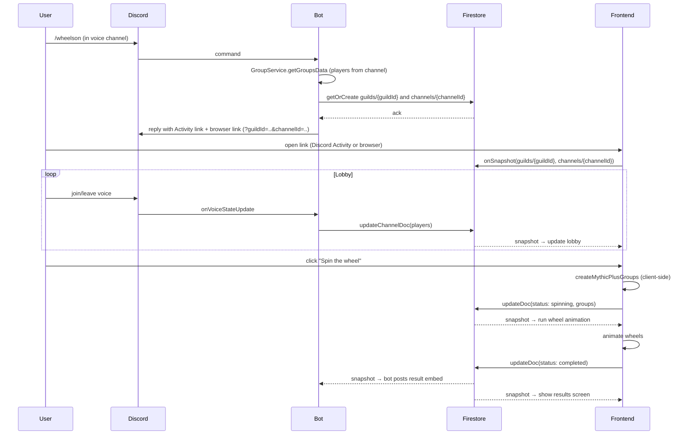
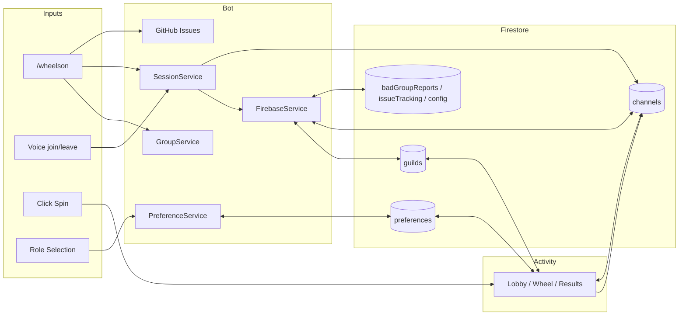

# Architecture Overview

This document gives a high-level picture of how the **Discord bot**, **Firebase (Firestore)**, and **Activity frontend** work together so you can quickly understand the system without diving into every file.

---

## What This System Does

**MythicPlusDiscordBot** helps a WoW guild form Mythic+ groups. It:

1. Uses Discord roles to know who can tank, heal, or DPS.
2. Can form balanced groups and show them in Discord (`/wheel`).
3. Can run an **Activity**: a shared lobby + “wheel” experience backed by Firebase. Someone runs `/wheelson` (also aliased as `/activity`) in a voice channel; others join via a Discord Activity or a browser link. The lobby stays in sync with who’s in voice; when someone clicks “Spin,” the frontend computes groups and runs a wheel animation, then everyone sees the final groups.

Firebase is the **real-time bridge** between the bot and the Activity frontend: both read and write the same set of guild/channel documents, so the UI and Discord stay in sync without the frontend talking to the bot directly.

---

## High-Level Architecture

```mermaid
flowchart TB
    subgraph Discord["Discord"]
        User[Users in voice channel]
        Channel[Text / Voice Channel]
    end

    subgraph Bot["Discord Bot (TypeScript)"]
        Cogs[Commands: groups, roles, general, debug]
        GroupService[GroupService]
        SessionService[SessionService]
        FirebaseService[FirebaseService]
        Core[Core: models, issues, storage]
        Cogs --> GroupService
        Cogs --> SessionService
        Cogs --> Core
        SessionService --> FirebaseService
        SessionService --> GroupService
    end

    subgraph Firebase["Firebase Firestore"]
        Guilds[guilds/&#123;guildId&#125;]
        Channels[channels/&#123;channelId&#125;]
        Preferences[preferences/&#123;discordId&#125;]
        Sidecars[badGroupReports, issueTracking, config]
    end

    subgraph Frontend["Activity Frontend (TypeScript/Vite)"]
        UI[Lobby, Wheel, Results]
        UI --> FirestoreClient[Firestore client SDK]
    end

    User -->|/wheelson, /wheel, voice join/leave| Channel
    Channel -->|commands, events| Bot
    Bot -->|read/write, real-time listener| Guilds
    Bot -->|read/write, real-time listener| Channels
    Bot -->|read/write| Preferences
    Bot -->|listen/write| Sidecars
    FirestoreClient -->|read/write, onSnapshot| Guilds
    FirestoreClient -->|read/write, onSnapshot| Channels
    FirestoreClient -->|read/write| Preferences
    User -->|open link with guildId/channelId| UI
```

- **Discord**: users run commands and join voice; the bot reacts to commands and voice state.
- **Bot**: handles commands, builds groups, and owns the lobby/channel lifecycle; it talks to Firestore via `FirebaseService` and `SessionService`.
- **Firestore**: shared real-time state. Per-guild docs (`guilds/`) hold voice channel lists, group history, and refresh requests; per-channel docs (`channels/`) hold the live lobby (players, status, groups). Sidecar collections (`preferences`, `badGroupReports`, `issueTracking`, `config`) handle role memory, user-submitted reports, GitHub issue tracking, and shared config (affixes, season).
- **Activity frontend**: a web app (Discord Activity or standalone URL) that subscribes to one guild + channel document pair and drives the lobby → wheel → results flow.

---

## Main Components

### 1. Discord Bot (TypeScript)

- **Entrypoint**: `packages/bot/src/main.ts` — creates the bot, loads commands, syncs slash commands, and on startup cleans up old Firestore channel documents (e.g. older than 24 hours).
- **Commands** (in `packages/bot/src/commands/`):
  - **groups**: `/wheel` (text groups), `/wheelson` (interactive wheel; `/activity` is accepted as a legacy alias), `/badgroup` (report bad logic), and `onVoiceStateUpdate` (lobby sync).
  - **general**: `/bug` & `/featurerequest` (GitHub integration), `/version`, `/status`, `/invite`.
  - **debug**: Debugging utilities.
- **Services** (in `packages/bot/src/services/`):
  - **GroupService**: gets players from a channel (using Discord roles), runs the group-creation algorithm (`createMythicPlusGroups`), and handles the “wheel” flows.
  - **SessionService**: creates the Firestore guild+channel docs when `/wheelson` is run, keeps a map of voice channel → channel doc, subscribes to those documents, and reacts to status changes.
- **Core** (in `packages/bot/src/core/`):
  - **firebaseService.ts**: initializes the Firebase Admin SDK and exposes typed CRUD for guild/channel/sidecar documents.
  - **preferenceService.ts**: reads/writes the `preferences` Firestore collection, with a local-JSON fallback when Firebase credentials are not configured.
  - **issues.ts**: **GitHub Integration**. Bridges Discord Modals to the GitHub API to automatically create issues for bugs, feature requests, and bad group reports.
  - **roleUi.ts**: **UI Components**. Contains the Discord MessageActionRow, Buttons, and Modals for the interactive Role Board.
  - **storage.ts**: Local-JSON fallback used by `preferenceService.ts` when `FIREBASE_CREDENTIALS_JSON` is unset.
- **Shared** (in `packages/shared/src/`):
  - **parallelGroupCreator**, **models**: shared group algorithm and data models used by both the bot and frontend mock data.

The bot does **not** serve the Activity UI; it only creates the guild/channel docs, reacts to Firestore updates, and posts messages/embeds in Discord.

### 2. Data Persistence (Firestore-first with local fallback)

The system uses Firestore as the primary store, with a local-JSON fallback for preferences when Firebase credentials are not configured:

1.  **Firebase Firestore (Cloud)**:
    *   **Purpose**: Real-time synchronization between the bot and the Activity frontend, plus durable storage for user preferences and operational metadata.
    *   **Scope**: Per-channel `channels/` docs are ephemeral (cleaned up after 24h on startup); per-guild `guilds/` docs and `preferences/` docs persist.
    *   **Collections**: `guilds`, `channels`, `preferences`, `badGroupReports`, `issueTracking`, `config` (see Section 3 below).

2.  **Local JSON (Disk, fallback only)**:
    *   **Purpose**: Used by `core/storage.ts` and `core/preferenceService.ts` as a fallback for role preferences when `FIREBASE_CREDENTIALS_JSON` is unset.
    *   **Scope**: Persistent across restarts (volume mounted in Docker).
    *   **File**: `player_preferences.json` (the canonical source is the Firestore `preferences` collection in normal operation).

### 3. Firebase (Firestore)

- **Role**: Real-time sync between the bot and the Activity frontend, plus durable preference and metadata storage. No direct HTTP API between frontend and bot.
- **Data**: Several top-level collections — see the layout below.

**Collection layout:**

| Collection         | Doc ID            | Owner / Notes |
|--------------------|-------------------|---------------|
| `guilds`           | `{guildId}`       | Per-guild state: `voiceChannels` list, `groupHistory`, `seasonPairs`, `refreshRequest`, plus guild metadata. |
| `channels`         | `{channelId}`     | Per-voice-channel lobby: `players`, `status`, `groups`, `sittingOut`, `guildId` back-reference. Cleaned up after 24h on startup. |
| `preferences`      | `{discordId}`     | Per-user saved roles, in-game name, character class, and media URL. Written by both the bot (`PreferenceService`) and the frontend. |
| `badGroupReports`  | auto-id           | Frontend writes a doc when a user clicks "report bad group"; the bot listens and files a GitHub issue. |
| `issueTracking`    | `{issueNumber}`   | Bot writes a tracking doc per `/bug` or `/featurerequest` so the GitHub close webhook can DM the reporter. |
| `config`           | `affixes`, `season` | Read-only at runtime; populated by Cloud Functions. |

**`channels/{channelId}` document shape:**

| Field       | Type      | Description |
|------------|-----------|-------------|
| `channelId`| string    | Discord voice channel ID (also the doc ID) |
| `guildId`  | string    | Back-reference to the parent guild doc |
| `channelName` | string | Voice channel display name |
| `status`   | string    | `lobby` → `spinning` → `completed` |
| `players`  | array     | List of player objects (name, roles, etc.) for the lobby |
| `groups`   | array     | Computed groups (tank, healer, dps); filled by the frontend on transition to `spinning` |
| `sittingOut` | array   | IDs of players sitting out the current round |
| `isDebug`  | boolean   | Whether this lobby is from `/test` |
| `createdAt`| timestamp | Used for startup cleanup |
| `lastActive`| timestamp | Updated on writes; used for the 24h cleanup query |

- **Bot**: creates the channel doc (status `lobby`), keeps `players` in sync with the voice channel via `SessionService`, and listens for `completed` to post the embed in Discord. It also listens to `badGroupReports` and the per-guild `refreshRequest` field.
- **Frontend**: subscribes with `onSnapshot` to a `guilds/{guildId}` doc and a `channels/{channelId}` doc (using `guildId` and `channelId` from the URL). When the user clicks Spin it runs `createMythicPlusGroups` client-side, writes the computed `groups` plus `status: spinning` directly, then writes `status: completed` after the animation finishes. The bot does **not** compute groups in Activity mode.

Security rules and cleanup are described in `FIREBASE_SETUP.md` and the canonical `firestore.rules` at the repo root.

### 4. Activity Frontend (TypeScript / Vite)

- **Role**: Provides the lobby and “wheel” experience for an Activity session. It is a **client-only** app that reads and writes Firestore; it never calls the bot.
- **Entry**: `activity/src/main.tsx`. On load it reads `guildId` and `channelId` from the query string (the Discord SDK can also supply them when launched as an Activity). `?sessionId=` is accepted as a deprecated alias for `guildId`. If neither is present, the app shows a message prompting the user to run `/wheelson` in Discord.
- **Firebase**: Uses the Firebase JS SDK (see `activity/src/firebase.ts`) with config from `VITE_FIREBASE_*` env vars. It uses Firestore only (no Auth in the minimal setup).
- **Flow**:
  1. Subscribe to `guilds/{guildId}` and `channels/{channelId}` with `onSnapshot`.
  2. **Lobby**: Always render the current `players` list; show/hide lobby vs wheel vs results based on `status`.
  3. **Spin**: User clicks “Spin” → frontend runs `createMythicPlusGroups` client-side and writes both `groups` and `status: 'spinning'` to the channel doc in one update.
  4. **Spinning**: Frontend animates the reveal in `activity/src/views/WheelsView.tsx`, then writes `status: 'completed'`.
  5. **Completed**: Show final groups; if the channel doc is deleted (e.g. new `/wheelson` in same channel), show “Activity ended.”

So the frontend is a **state machine** driven by the guild + channel documents in Firestore.

#### Frontend Modes
The Activity frontend (`activity/src/main.tsx`) operates in three distinct modes to support production, demos, and testing:

1.  **Firebase Mode (Production):**
    -   Triggered when a `?guildId=...` (and optionally `?channelId=...`) query parameter is present, or when launched as a Discord Activity. `?sessionId=` is also accepted as a deprecated alias for `guildId`.
    -   Connects to live Firestore to sync with the Discord bot.
2.  **Demo Mode (Standalone):**
    -   Triggered by clicking "Start Demo" in the UI (when no guild/channel ID is found).
    -   Uses `mockSession` data purely in-memory. Allows users to "test drive" the UI without a Discord bot.
3.  **Mock/Static Mode (Testing):**
    -   Triggered by injecting a base64-encoded JSON object via the `?data=...` query parameter.
    -   Used by **automated tests** (Playwright) to force the UI into specific states (e.g., displaying results) without needing a backend.

---

### 5. Firebase Cloud Functions (v2)

- **Role**: Securely handles background synchronization, external integrations, and API rate limiting outside the bot's hot path.
- **Entry**: `packages/functions/src/index.ts`. Deployed to Firebase natively using Firebase Functions v2.
- **Key Functions**:
  - `fetchWeeklyAffixes` (`fetchWeeklyAffixes.ts:70`): Scheduled function (`onSchedule`) that fires weekly on Tuesdays to pull current Mythic+ affix data from the **Raider.IO API** and sync it to the `config/affixes` Firestore document.
  - `refreshAffixes` (`fetchWeeklyAffixes.ts:83`): Callable counterpart (`onCall`) for on-demand manual refresh of affix data (e.g. after a deploy or if the scheduled run failed).
  - `lookupCharacter` (`lookupCharacter.ts:56`): Callable function (`onCall`) that securely bridges the Activity frontend to the **Battle.net API**, enforcing rate limits and caching results in Firestore (`characters/` collection).
  - `refreshCharacterMedia` (`refreshCharacterMedia.ts:219`): Scheduled function (`onSchedule`) that fires weekly on Tuesdays to bulk-refresh character portrait and class data for all users in the `preferences/` collection.
  - `refreshCharacterMediaNow` (`refreshCharacterMedia.ts:233`): Callable counterpart (`onCall`) for on-demand manual refresh of character media.
  - `onGithubIssueWebhook` (`githubWebhook.ts:101`): An HTTP (`onRequest`) webhook that receives GitHub issue closed events and notifies the reporting Discord user directly.

#### Webhook Notification Flow

When a user reports a bug via the bot, the bot writes a tracking document to Firestore. When GitHub closes the issue, the Cloud Function is called, looks up the tracking document, sends a Discord DM directly, and deletes the document — all synchronously within the HTTP request.

## How an Activity Run Works (End-to-End)

This is the sequence from “someone runs `/wheelson`” to “everyone sees groups.”

- **Creation**: Bot creates the guild + channel docs and returns links; frontend only needs the URL with `guildId`/`channelId`.
- **Lobby**: Bot keeps `players` on the channel doc in sync with voice; frontend only reads and renders.
- **Spin**: Frontend computes `groups` client-side and writes `spinning` + `groups` to the channel doc; frontend animates and writes `completed`; bot listens for `completed` and posts the result embed in Discord.

---

## Where Key Behaviors Live

| Concern | Where it lives |
|--------|-----------------|
| Slash commands (`/wheelson`, `/wheel`) | `packages/bot/src/commands/groups.ts` |
| Role Board / Saved Roles | `packages/bot/src/core/roleUi.ts`, `packages/bot/src/core/preferenceService.ts` (Firestore + local fallback in `core/storage.ts`) |
| GitHub Issues (`/bug`, `/badgroup`) | `packages/bot/src/core/issues.ts`, `packages/bot/src/commands/general.ts`, `packages/bot/src/commands/groups.ts` |
| Voice → lobby sync | `packages/bot/src/commands/groups.ts` (`onVoiceStateUpdate`) → `SessionService.updateChannelPlayers` |
| Channel/guild doc create/listen/update | `SessionService` + `FirebaseService` |
| Group algorithm | `packages/shared/src/parallelGroupCreator.ts` |
| “Spin” handling | Frontend: `activity/src/services/firestoreService.ts` (`requestSpin`) — runs the algorithm client-side and writes `spinning`+`groups` |
| Activity UI and wheel | `activity/src/main.tsx`, `activity/src/views/WheelsView.tsx` |
| Channel doc cleanup | `packages/bot/src/main.ts` (startup), `SessionService.cleanupChannel` |
| Discord.js adapters | `packages/bot/src/core/discordAdapters.ts` |
| Wire-field validators | `packages/shared/src/seasonPairs.ts`, `packages/shared/src/groupHistoryWire.ts`, `packages/shared/src/types.ts` |
| Realm slug & region utils | `packages/shared/src/realmSlug.ts` |

---

## Configuration That Ties Everything Together

- **Bot ↔ Firebase**: `FIREBASE_CREDENTIALS_JSON` (service account JSON). If unset, the bot runs but Activity/lobby and Firestore-backed preference features are disabled (preferences fall back to local JSON).
- **Frontend ↔ Firebase**: `VITE_FIREBASE_*` (apiKey, authDomain, projectId, etc.) in the Activity build.
- **Activity link**: Bot builds the browser link as `${ACTIVITY_URL}?guildId={guildId}&channelId={channelId}` (e.g. `ACTIVITY_URL` from env or default GitHub Pages URL). The frontend also accepts `?sessionId=` as a deprecated alias for `guildId`.
- **Discord Activity**: `DISCORD_APPLICATION_ID` is used when creating the embedded application invite for the voice channel.
- **GitHub Integration**: `GITHUB_TOKEN`, `GITHUB_REPO_OWNER`, `GITHUB_REPO_NAME` are required for `/bug` and `/featurerequest` to work.

For step-by-step Firebase and env setup, see `FIREBASE_SETUP.md` and `README.md`.

---

## Summary Diagram

- **Bot**: commands and voice events → GroupService + SessionService → FirebaseService → Firestore (`guilds/`, `channels/`, sidecars).
- **Firestore**: shared real-time state plus durable `preferences/` and operational sidecars.
- **Activity**: URL with `guildId`/`channelId` → subscribe to guild + channel docs → user clicks Spin → write status → read updates and drive UI.
- **Preferences**: User role preferences are persisted in the Firestore `preferences/` collection by `PreferenceService`, with local JSON as a fallback.
- **Issues**: Bug reports are sent to GitHub.

This should be enough to get a clear mental model of how the bot, Firebase, and Activity frontend work together. For implementation details, use this doc as a map and then open the referenced files.
