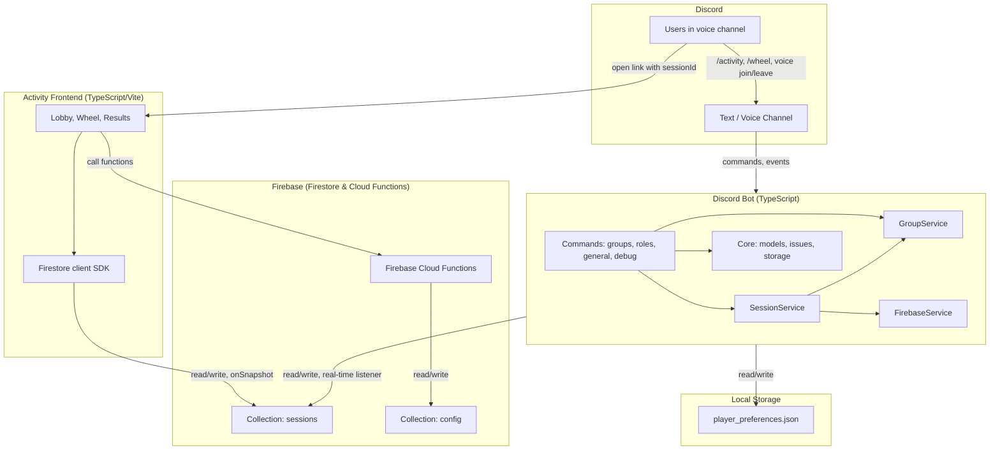
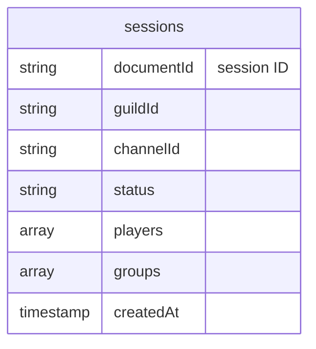
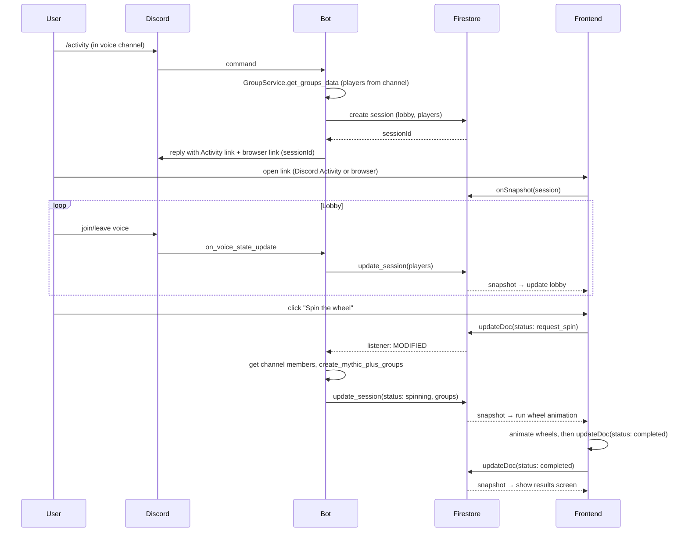

# Architecture Overview

This document gives a high-level picture of how the **Discord bot**, **Firebase (Firestore)**, and **Activity frontend** work together so you can quickly understand the system without diving into every file.

---

## What This System Does

**MythicPlusDiscordBot** helps a WoW guild form Mythic+ groups. It:

1. Uses Discord roles to know who can tank, heal, or DPS.
2. Can form balanced groups and show them in Discord (`/wheel`).
3. Can run an **Activity**: a shared lobby + “wheel” experience backed by Firebase. Someone runs `/activity` in a voice channel; others join via a Discord Activity or a browser link. The lobby stays in sync with who’s in voice; when someone clicks “Spin,” the bot computes groups and the frontend runs a wheel animation, then everyone sees the final groups.

Firebase is the **real-time bridge** between the bot and the Activity frontend: both read and write the same “session” document, so the UI and Discord stay in sync without the frontend talking to the bot directly.

---

## High-Level Architecture



- **Discord**: users run commands and join voice; the bot reacts to commands and voice state.
- **Bot**: handles commands, builds groups, and owns the “session” lifecycle; it talks to Firestore via `FirebaseService` and `SessionService`.
- **Firestore**: single source of truth for each Activity session (players, status, groups). Bot and frontend both connect to the same project.
- **Local Storage**: persist user role preferences (Tank/Healer/DPS) in a local JSON file.
- **Activity frontend**: a web app (Discord Activity or standalone URL) that subscribes to one session document and drives the lobby → wheel → results flow.

---

## Main Components

### 1. Discord Bot (TypeScript)

- **Entrypoint**: `packages/bot/src/main.ts` — creates the bot, loads commands, syncs slash commands, and on startup cleans up old Firestore sessions (e.g. older than 24 hours).
- **Commands** (in `packages/bot/src/commands/`):
  - **groups**: `/wheel` (text groups), `/activity` (interactive wheel), `/badgroup` (report bad logic), and `onVoiceStateUpdate` (lobby sync).
  - **general**: `/bug` & `/featurerequest` (GitHub integration), `/version`, `/status`, `/invite`.
  - **debug**: Debugging utilities.
- **Services** (in `packages/bot/src/services/`):
  - **GroupService**: gets players from a channel (using Discord roles), runs the group-creation algorithm (`createMythicPlusGroups`), and handles the “wheel” flows.
  - **SessionService**: creates a Firestore session when `/activity` is run, keeps a map of voice channel → session, subscribes to that session’s document, and reacts to status changes.
- **Core** (in `packages/bot/src/core/`):
  - **FirebaseService**: initializes the Firebase Admin SDK, exposes session management.
  - **issues.ts**: **GitHub Integration**. Bridges Discord Modals to the GitHub API to automatically create issues for bugs, feature requests, and bad group reports.
  - **roleUi.ts**: **UI Components**. Contains the Discord MessageActionRow, Buttons, and Modals for the interactive Role Board.
  - **storage.ts**: **Persistence**. Manages local JSON storage (`player_preferences.json`) for user role preferences.
- **Shared** (in `packages/shared/src/`):
  - **parallelGroupCreator**, **models**: shared group algorithm and data models used by both the bot and frontend mock data.

The bot does **not** serve the Activity UI; it only creates sessions, reacts to Firestore updates, and posts messages/embeds in Discord.

### 2. Firebase Cloud Functions (`packages/functions`)

The system utilizes Firebase Cloud Functions to handle periodic tasks, external API integrations, and webhook processing:

- **Periodic Data Syncing**: The `fetchWeeklyAffixes` scheduled function runs weekly to fetch current Mythic+ affixes from Raider.IO and sync them to the `config/affixes` document in Firestore.
- **External API Access**: The `lookupCharacter` callable function securely queries the Battle.net API, avoiding exposing API keys to the frontend, and handles rate limiting.
- **Webhook Bridging**: The `onGithubIssueWebhook` function listens to GitHub events and bridges them to the internal Discord notification system via Firestore.

For more details on the Cloud Functions, see the [API Reference](API.md).

### 3. Data Persistence (Hybrid Model)

The system uses a **Hybrid Persistence** model:

1.  **Firebase Firestore (Cloud)**:
    *   **Purpose**: Real-time synchronization of "Activity Sessions" between the TypeScript Bot and the TypeScript Frontend.
    *   **Scope**: Ephemeral. Sessions are created on demand and cleaned up after 24 hours.
    *   **Collection**: `sessions`.

2.  **Local JSON (Disk)**:
    *   **Purpose**: Long-term storage of user role preferences (e.g., "Player A prefers Tank").
    *   **Scope**: Persistent across restarts (volume mounted in Docker).
    *   **File**: `player_preferences.json` (managed by `core/storage.ts`).

### 4. Firebase (Firestore)

- **Role**: Real-time sync between the bot and the Activity frontend. No direct HTTP API between frontend and bot.
- **Data**: One collection, `sessions`. Each document is one Activity instance.

**Session document shape (conceptual):**

| Field       | Type     | Description |
|------------|----------|-------------|
| `guildId`  | string   | Discord guild ID |
| `channelId`| string   | Discord voice channel ID |
| `status`   | string   | `lobby` → `request_spin` → `spinning` → `completed` |
| `players`  | array    | List of player objects (name, roles) for the lobby |
| `groups`   | array    | Computed groups (tank, healer, dps), filled when bot sets `spinning` |
| `createdAt`| timestamp| Used for cleanup of old sessions |



- **Bot**: creates the document (status `lobby`), updates `players` on voice changes, and on `request_spin` writes `status: spinning` and `groups`.
- **Frontend**: subscribes with `onSnapshot` to the document (using `sessionId` from the URL), updates `status` to `request_spin` when the user clicks Spin, then to `completed` when the wheel animation finishes.

Security and cleanup are described in `FIREBASE_SETUP.md` (rules, session replacement, startup cleanup).

### 5. Activity Frontend (TypeScript / Vite)

- **Role**: Provides the lobby and “wheel” experience for an Activity session. It is a **client-only** app that reads and writes Firestore; it never calls the bot.
- **Entry**: `activity/src/main.ts`. On load it reads `sessionId` from the query string (`?sessionId=...`). If missing, it shows a message like “Use /activity in Discord.”
- **Firebase**: Uses the Firebase JS SDK (see `activity/src/firebase.ts`) with config from `VITE_FIREBASE_*` env vars. It uses Firestore only (no Auth in the minimal setup).
- **Flow**:
  1. Subscribe to `sessions/{sessionId}` with `onSnapshot`.
  2. **Lobby**: Always render the current `players` list; show/hide lobby vs wheel vs results based on `status`.
  3. **Spin**: User clicks “Spin” → frontend calls `updateDoc` to set `status: 'request_spin'`. Bot (via its listener) computes groups and sets `status: 'spinning'` and `groups`.
  4. **Spinning**: Frontend sees `spinning` and `groups`, runs the wheel animation (e.g. `wheel.ts`), then sets `status: 'completed'`.
  5. **Completed**: Show final groups; if the document is deleted (e.g. new `/activity` in same channel), show “Activity ended.”

So the frontend is a **state machine** driven by the single session document in Firestore.

#### Frontend Modes
The Activity frontend (`activity/src/main.ts`) operates in three distinct modes to support production, demos, and testing:

1.  **Firebase Mode (Production):**
    -   Triggered when a `?sessionId=...` or `?guildId=...` query parameter is present.
    -   Connects to live Firestore to sync with the Discord bot.
2.  **Demo Mode (Standalone):**
    -   Triggered by clicking "Start Demo" in the UI (when no session ID is found).
    -   Uses `mockSession` data purely in-memory. Allows users to "test drive" the UI without a Discord bot.
3.  **Mock/Static Mode (Testing):**
    -   Triggered by injecting a base64-encoded JSON object via the `?data=...` query parameter.
    -   Used by **automated tests** (Playwright) to force the UI into specific states (e.g., displaying results) without needing a backend.

---

## How an Activity Run Works (End-to-End)

This is the sequence from “someone runs `/activity`” to “everyone sees groups.”



- **Creation**: Bot creates the session and returns links; frontend only needs the URL with `sessionId`.
- **Lobby**: Bot keeps `players` in sync with voice; frontend only reads and renders.
- **Spin**: Frontend writes `request_spin`; bot computes and writes `spinning` + `groups`; frontend animates then writes `completed`.

---

## Where Key Behaviors Live

| Concern | Where it lives |
|--------|-----------------|
| Slash commands (`/activity`, `/wheel`) | `packages/bot/src/commands/groups.ts` |
| Role Board / Saved Roles | `packages/bot/src/core/roleUi.ts`, `packages/bot/src/core/storage.ts` |
| GitHub Issues (`/bug`, `/badgroup`) | `packages/bot/src/core/issues.ts`, `packages/bot/src/commands/general.ts`, `packages/bot/src/commands/groups.ts` |
| Voice → lobby sync | `packages/bot/src/commands/groups.ts` (`onVoiceStateUpdate`) → `SessionService.updateChannelPlayers` |
| Session create/listen/update | `SessionService` + `FirebaseService` |
| Group algorithm | `packages/shared/src/parallelGroupCreator.ts` |
| “Spin” handling | `SessionService.processSpinRequest` |
| Activity UI and wheel | `activity/src/main.ts`, `activity/src/wheel.ts` |
| Session cleanup | `packages/bot/src/main.ts` (startup), `SessionService.cleanupChannel` |

---

## Configuration That Ties Everything Together

- **Bot ↔ Firebase**: `FIREBASE_CREDENTIALS_JSON` (service account JSON). If unset, the bot runs but Activity/session features are disabled.
- **Frontend ↔ Firebase**: `VITE_FIREBASE_*` (apiKey, authDomain, projectId, etc.) in the Activity build.
- **Activity link**: Bot builds the browser link as `ACTIVITY_URL?sessionId={sessionId}` (e.g. `ACTIVITY_URL` from env or default GitHub Pages URL).
- **Discord Activity**: `DISCORD_APPLICATION_ID` is used when creating the embedded application invite for the voice channel.
- **GitHub Integration**: `GITHUB_TOKEN`, `GITHUB_REPO_OWNER`, `GITHUB_REPO_NAME` are required for `/bug` and `/featurerequest` to work.

For step-by-step Firebase and env setup, see `FIREBASE_SETUP.md` and `README.md`.

---

## Summary Diagram

```mermaid
flowchart LR
    subgraph Inputs
        Cmd["/activity"]
        Voice["Voice join/leave"]
        Click["Click Spin"]
        Role["Role Selection"]
    end

    subgraph Bot
        GS[GroupService]
        SS[SessionService]
        FS[FirebaseService]
        Store[Storage (JSON)]
        Issues[GitHub Issues]
    end

    subgraph Firestore
        S[(sessions)]
    end

    subgraph Activity
        UI[Lobby / Wheel / Results]
    end

    Cmd --> GS
    Cmd --> SS
    Voice --> SS
    SS --> FS
    FS <--> S
    S <--> UI
    Click --> UI
    UI --> S
    SS --> S
    Role --> Store
    Cmd --> Issues
```

- **Bot**: commands and voice events → GroupService + SessionService → FirebaseService → Firestore.
- **Firestore**: shared session state.
- **Activity**: URL with `sessionId` → subscribe to session → user clicks Spin → write status → read updates and drive UI.
- **Storage**: User role preferences are saved locally.
- **Issues**: Bug reports are sent to GitHub.

This should be enough to get a clear mental model of how the bot, Firebase, and Activity frontend work together. For implementation details, use this doc as a map and then open the referenced files.
