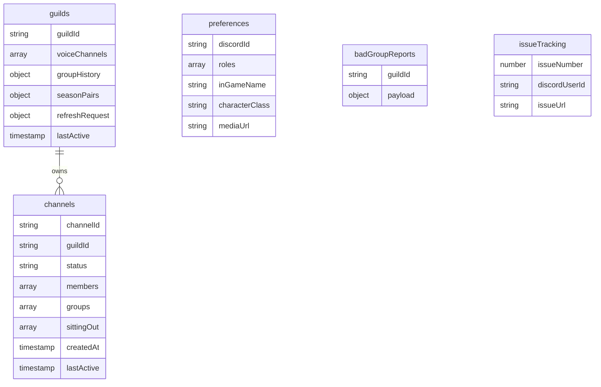
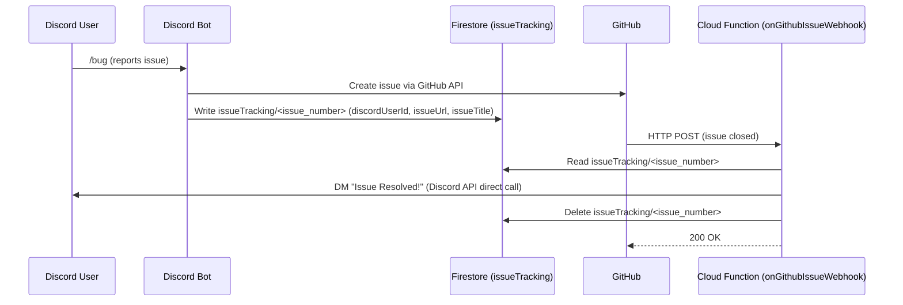
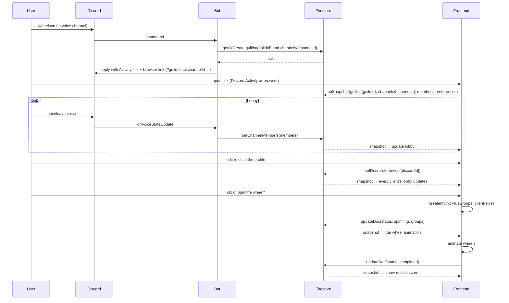
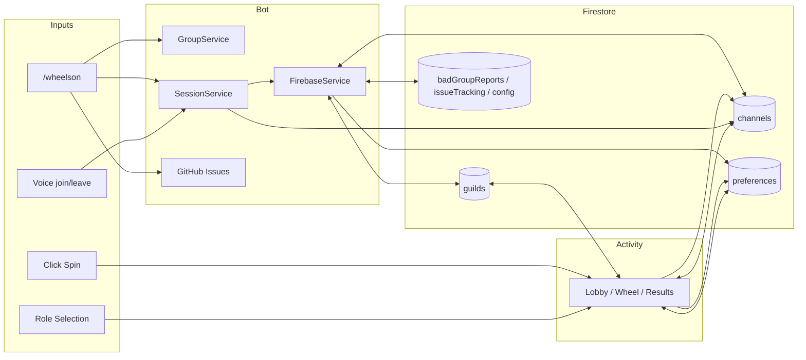

# Architecture Overview

This document gives a high-level picture of how the **Discord bot**, **Firebase (Firestore)**, and **Activity frontend** work together so you can quickly understand the system without diving into every file.

---

## What This System Does

**MythicPlusDiscordBot** helps a WoW guild form Mythic+ groups. It:

1. Remembers who can tank, heal, or DPS in each player's profile (`preferences/{discordId}`), edited in the Activity.
2. Can form balanced groups and show them in Discord (`/wheel`).
3. Can run an **Activity**: a shared lobby + “wheel” experience backed by Firebase. Players launch the Wheelson activity in a voice channel (or someone runs `/wheelson`); others join via a Discord Activity or a browser link. The lobby stays in sync with who’s in voice; when someone clicks “Spin,” the frontend computes groups and runs a wheel animation, then everyone sees the final groups.

Firebase is the **real-time bridge** between the bot and the Activity frontend: both read and write the same set of guild/channel documents, so the UI and Discord stay in sync without the frontend talking to the bot directly.

---

## High-Level Architecture

```mermaid
flowchart TB
    subgraph Discord["Discord"]
        User[Users in voice channel]
        Channel[Text / Voice Channel]
    end

    subgraph Bot["Discord Bot (TypeScript)"]
        Cogs[Commands: groups, debug, bug/feature reports]
        GroupService[GroupService]
        SessionService[SessionService]
        FirebaseService[FirebaseService]
        Core[Core: models, issues, UI]
        Cogs --> GroupService
        Cogs --> SessionService
        Cogs --> Core
        SessionService --> FirebaseService
        SessionService --> GroupService
    end

    subgraph Firebase["Firebase Firestore"]
        Guilds[guilds/&#123;guildId&#125;]
        Channels[channels/&#123;channelId&#125;]
        Preferences[preferences/&#123;discordId&#125;]
        Sidecars[badGroupReports, issueTracking, config]
    end

    subgraph Frontend["Activity Frontend (TypeScript/Vite)"]
        UI[Lobby, Wheel, Results]
        UI --> FirestoreClient[Firestore client SDK]
    end

    User -->|/wheelson, /wheel, voice join/leave| Channel
    Channel -->|commands, events| Bot
    Bot -->|read/write, real-time listener| Guilds
    Bot -->|read/write, real-time listener| Channels
    Bot -->|read| Preferences
    Bot -->|listen/write| Sidecars
    FirestoreClient -->|read/write, onSnapshot| Guilds
    FirestoreClient -->|read/write, onSnapshot| Channels
    FirestoreClient -->|read/write, onSnapshot| Preferences
    User -->|open link with guildId/channelId| UI
```

- **Discord**: users run commands and join voice; the bot reacts to commands and voice state.
- **Bot**: handles commands, builds groups, and owns the lobby/channel lifecycle; it talks to Firestore via `FirebaseService` and `SessionService`.
- **Firestore**: shared real-time state. Per-guild docs (`guilds/`) hold voice channel lists, group history, and refresh requests; per-channel docs (`channels/`) hold the live lobby (voice `members`, status, groups). `preferences/` holds each player's profile (roles, character) and is its single source of truth. Sidecar collections (`badGroupReports`, `issueTracking`, `config`) handle user-submitted reports, GitHub issue tracking, and shared config (affixes, season).
- **Activity frontend**: a web app (Discord Activity or standalone URL) that subscribes to one guild + channel document pair plus the members' preferences docs, and drives the lobby → wheel → results flow.

---

## Main Components

### 1. Discord Bot (TypeScript)

- **Entrypoint**: `packages/bot/src/main.ts` — creates the bot, loads commands, and syncs slash commands.
- **Commands** (in `packages/bot/src/commands/`):
  - **groups**: `/wheel` (text groups) and `/wheelson` (interactive wheel).
  - `/bug` & `/featurerequest` (GitHub integration) are handled in `main.ts`.
  - **debug**: Debugging utilities.
- **Services** (in `packages/bot/src/services/`):
  - **GroupService**: for `/wheel`, reads the voice members' `preferences` docs on demand, builds players with `WoWPlayer.fromPreferences`, runs the group-creation algorithm (`createMythicPlusGroups`), and announces the groups.
  - **SessionService**: creates the Firestore guild+channel docs when `/wheelson` is run, and follows the `channels` collection so every lobby doc (created by the bot or the Activity, or already there after a restart) is tracked. On voice join/leave it rewrites that lobby's `members`, and deletes the lobby when its last human leaves.
- **Core** (in `packages/bot/src/core/`):
  - **firebaseService.ts**: initializes the Firebase Admin SDK and exposes typed CRUD for guild/channel/sidecar documents.
  - **issues.ts**: **GitHub Integration**. Bridges Discord Modals to the GitHub API to automatically create issues for bugs, feature requests, and bad group reports.
- **Shared** (in `packages/shared/src/`):
  - **parallelGroupCreator**, **models**: shared group algorithm and data models used by both the bot and the frontend.
  - **profiles**: the `LobbyMember` / `PlayerPreferences` wire shapes and their parsers. `WoWPlayer.fromPreferences(member, prefs)` is the one factory that joins them, used by both `/wheel` and the Activity lobby.

The bot does **not** serve the Activity UI; it creates the guild/channel docs, keeps lobby `members` in sync with voice, and reacts to Firestore requests (voice channel list refreshes, bad-group reports). It keeps no player data in memory or on disk.

### 2. Data Persistence

Firestore is the only store. Per-channel `channels/` docs are ephemeral (deleted when a lobby empties, or by a Firestore TTL policy 24h after the bot last wrote to them); per-guild `guilds/` docs and `preferences/` docs persist. The bot keeps nothing on disk.

### 3. Firebase (Firestore)

- **Role**: Real-time sync between the bot and the Activity frontend, plus durable preference and metadata storage. No direct HTTP API between frontend and bot.
- **Data**: Several top-level collections — see the layout below.

**Collection layout:**

| Collection         | Doc ID            | Owner / Notes |
|--------------------|-------------------|---------------|
| `guilds`           | `{guildId}`       | Per-guild state: `voiceChannels` list, `groupHistory`, `seasonPairs`, `refreshRequest`, plus guild metadata. |
| `channels`         | `{channelId}`     | Per-voice-channel lobby: `members` (bot-only), `status`, `groups`, `sittingOut`, `guildId` back-reference. Deleted by the `expireAt` TTL policy when abandoned. |
| `preferences`      | `{discordId}`     | Each player's profile: roles, in-game name, linked character, character class, and media URL. The single source of truth for profiles; written by the Activity and the weekly `refreshCharacterMedia` function, read by the bot and the Activity. |
| `badGroupReports`  | auto-id           | Frontend writes a doc when a user clicks "report bad group"; the bot listens and files a GitHub issue. |
| `issueTracking`    | `{issueNumber}`   | Bot writes a tracking doc per `/bug` or `/featurerequest` so the GitHub close webhook can DM the reporter. |
| `config`           | `affixes`, `season` | Read-only at runtime; populated by Cloud Functions. |
| `rateLimits`       | `{uid}_{endpoint}` | Per-user callable rate-limit windows; Cloud Functions only. Expired by TTL. |
| `characterCache`   | `{region}:{realm}:{name}` | Battle.net lookup cache; Cloud Functions only. Expired by TTL 30 days after its last refresh. |

**`channels/{channelId}` document shape:**

| Field       | Type      | Description |
|------------|-----------|-------------|
| `channelId`| string    | Discord voice channel ID (also the doc ID) |
| `guildId`  | string    | Back-reference to the parent guild doc |
| `channelName` | string | Voice channel display name |
| `status`   | string    | `lobby` → `spinning` → `completed` |
| `members`  | array     | `{ discordId, name }` for everyone in the voice channel (name = display name, dots stripped). Written only by the bot; clients join it with `preferences` |
| `groups`   | array     | Computed groups (tank, healer, dps); filled by the frontend on transition to `spinning` |
| `sittingOut` | array   | IDs of players sitting out the current round |
| `isDebug`  | boolean   | Whether this lobby is from `/test` |
| `createdAt`| timestamp | When the lobby was created |
| `lastActive`| timestamp | Updated on lobby creation and on every bot `members` write |
| `expireAt` | timestamp | Bot-only. 24h after the bot's latest write; the TTL policy in `firestore.indexes.json` deletes the lobby once it passes |

```mermaid
erDiagram
    guilds ||--o{ channels : "owns"
    guilds {
        string guildId
        array voiceChannels
        object groupHistory
        object seasonPairs
        object refreshRequest
        timestamp lastActive
    }
    channels {
        string channelId
        string guildId
        string status
        array members
        array groups
        array sittingOut
        timestamp createdAt
        timestamp lastActive
    }
    preferences {
        string discordId
        array roles
        string inGameName
        string characterClass
        string mediaUrl
    }
    badGroupReports {
        string guildId
        object payload
    }
    issueTracking {
        number issueNumber
        string discordUserId
        string issueUrl
    }
```

- **Bot**: creates the channel doc (status `lobby`) and keeps `members` in sync with the voice channel via `SessionService`. It also listens to `badGroupReports` and the per-guild `refreshRequest` field. It doesn't post anything when a round completes.
- **Frontend**: subscribes with `onSnapshot` to a `guilds/{guildId}` doc and a `channels/{channelId}` doc (using `guildId` and `channelId` from the URL), plus the `preferences` docs of the lobby members and the current user (`where(documentId(), 'in', ids)`, 30 IDs per query). The store joins them into the `players` roster every view reads. Profile edits write only `preferences`; every client's roster follows. When the user clicks Spin it runs `createMythicPlusGroups` client-side, writes the computed `groups` plus `status: spinning` directly, then writes `status: completed` after the animation finishes. The bot does **not** compute groups in Activity mode.

Security rules and cleanup are described in `FIREBASE_SETUP.md` and the canonical `firestore.rules` at the repo root.

### 4. Activity Frontend (TypeScript / Vite)

- **Role**: Provides the lobby and “wheel” experience for an Activity session. It is a **client-only** app that reads and writes Firestore; it never calls the bot.
- **Entry**: `activity/src/main.tsx`. On load it reads `guildId` and `channelId` from the query string (the Discord SDK can also supply them when launched as an Activity). `?sessionId=` is accepted as a deprecated alias for `guildId`. If neither is present, the app shows a message prompting the user to run `/wheelson` in Discord.
- **Firebase**: Uses the Firebase JS SDK (see `activity/src/firebase.ts`) with config from `VITE_FIREBASE_*` env vars. It signs in anonymously so `firestore.rules` can check its writes.
- **Identity**: By default the activity works out who the user is: the Discord ID remembered in localStorage, then a match against the activity's Discord participants, then the "Select Your Name" picker. Inside the Discord activity the user can opt in to **Sign in with Discord** (identity picker or profile modal; `activity/src/services/discordAuth.ts`). The Embedded App SDK's `authorize` returns an OAuth2 code (Discord shows its one-click consent modal the first time), the `discordSignIn` Cloud Function verifies it and returns a Firebase custom token whose uid is the Discord ID, and the activity signs in with it. That ID (`verifiedDiscordId` in the store) overrides every guess, and Firebase Auth keeps the session, so later launches restore it without asking. `firestore.rules` treat both kinds of user the same.
- **Flow**:
  1. Subscribe to `guilds/{guildId}`, `channels/{channelId}` and the members' `preferences` docs with `onSnapshot`.
  2. **Lobby**: Always render the joined roster (`members` + `preferences`); show/hide lobby vs wheel vs results based on `status`.
  - **Profile**: the header avatar and profile modal read the current user's `preferences` doc (their Discord ID is remembered in localStorage between visits; nothing else is). Without a known ID, the modal asks the user to pick themselves in a lobby first.
  3. **Spin**: User clicks “Spin” → frontend runs `createMythicPlusGroups` client-side and writes both `groups` and `status: 'spinning'` to the channel doc in one update.
  4. **Spinning**: Frontend animates the reveal in `activity/src/views/WheelsView.tsx`, then writes `status: 'completed'`.
  5. **Completed**: Show final groups; if the channel doc is deleted (e.g. new `/wheelson` in same channel), show “Activity ended.”

So the frontend is a **state machine** driven by the guild + channel documents in Firestore.

#### Frontend Modes
The Activity frontend (`activity/src/main.tsx`) operates in three distinct modes to support production, demos, and testing:

1.  **Firebase Mode (Production):**
    -   Triggered when a `?guildId=...` (and optionally `?channelId=...`) query parameter is present, or when launched as a Discord Activity. `?sessionId=` is also accepted as a deprecated alias for `guildId`.
    -   Connects to live Firestore to sync with the Discord bot.
2.  **Demo Mode (Standalone):**
    -   Triggered by clicking "Start Demo" in the UI (when no guild/channel ID is found).
    -   Uses `mockSession` data purely in-memory. Allows users to "test drive" the UI without a Discord bot.
3.  **Mock/Static Mode (Testing):**
    -   Triggered by injecting a base64-encoded JSON object via the `?data=...` query parameter.
    -   Used by **automated tests** (Playwright) to force the UI into specific states (e.g., displaying results) without needing a backend.

---

### 5. Firebase Cloud Functions (v2)

- **Role**: Securely handles background synchronization, external integrations, and API rate limiting outside the bot's hot path.
- **Entry**: `packages/functions/src/index.ts`. Deployed to Firebase natively using Firebase Functions v2.
- **Key Functions**:
  - `fetchWeeklyAffixes` (`fetchWeeklyAffixes.ts`): Scheduled function (`onSchedule`) that fires weekly on Tuesdays to pull current Mythic+ affix data from the **Raider.IO API** and sync it to the `config/affixes` and `config/season` Firestore documents.
  - `lookupCharacter` (`lookupCharacter.ts`): Callable function (`onCall`) that securely bridges the Activity frontend to the **Battle.net API**, enforcing rate limits and caching results in Firestore (`characterCache/` collection, expired by TTL). It answers `not-found` only when Battle.net has no such character (a 404); a rate limit or outage is `unavailable`, which the Activity shows as a retryable failure rather than a bad name.
  - `discordSignIn` (`discordSignIn.ts`): Callable function (`onCall`) behind the activity's optional Discord sign-in. Exchanges the OAuth2 code from the Embedded App SDK's `authorize` for an access token, reads the user's Discord ID, and returns a Firebase custom token for that ID. The access token never leaves the function.
  - `refreshCharacterMedia` (`refreshCharacterMedia.ts`): Scheduled function (`onSchedule`) that fires weekly on Tuesdays to bulk-refresh character portrait and class data for all users in the `preferences/` collection. A Battle.net failure skips that player for the week; only a 404 for a typed name clears the character fields.
  - `onGithubIssueWebhook` (`githubWebhook.ts`): An HTTP (`onRequest`) webhook that receives GitHub issue closed events and notifies the reporting Discord user directly.
- **Manual runs**: There are no callable "refresh now" functions. To run a scheduled function on demand, use **Force run** on its job in Cloud Scheduler (Google Cloud console).
- **Secrets**: Credentials live in Google Secret Manager and are read with `defineSecret` from `firebase-functions/params`. Each function lists the secrets it uses in its `secrets` option (`battleNetSecrets` from `battlenet.ts` for the Battle.net callers). See `FIREBASE_SETUP.md` section 7.
- **Build and deploy**: `npm -w packages/functions run build` bundles `src/` with esbuild (`build.mjs`) into `dist/index.js`, inlining `@mythicplus/shared`; `firebase-admin` and `firebase-functions` stay external runtime dependencies. `tsc` is typecheck-only. The `deploy-firebase` job in `deploy.yml` builds the bundle, strips `devDependencies` from `package.json` (Cloud Build runs a lockfile-less `npm install`, and the workspace-only `@mythicplus/shared` isn't on npm), then runs `firebase deploy`.

#### Webhook Notification Flow

When a user reports a bug via the bot, the bot writes a tracking document to Firestore. When GitHub closes the issue, the Cloud Function is called, looks up the tracking document, sends a Discord DM directly, and deletes the document — all synchronously within the HTTP request.

```mermaid
sequenceDiagram
    participant User as Discord User
    participant Bot as Discord Bot
    participant Firestore as Firestore (issueTracking)
    participant GitHub
    participant Webhook as Cloud Function (onGithubIssueWebhook)

    User->>Bot: /bug (reports issue)
    Bot->>GitHub: Create issue via GitHub API
    Bot->>Firestore: Write issueTracking/<issue_number> (discordUserId, issueUrl, issueTitle)
    GitHub->>Webhook: HTTP POST (issue closed)
    Webhook->>Firestore: Read issueTracking/<issue_number>
    Webhook->>User: DM "Issue Resolved!" (Discord API direct call)
    Webhook->>Firestore: Delete issueTracking/<issue_number>
    Webhook-->>GitHub: 200 OK
```

## How an Activity Run Works (End-to-End)

This is the sequence from “someone runs `/wheelson`” to “everyone sees groups.”

```mermaid
sequenceDiagram
    participant User
    participant Discord
    participant Bot
    participant Firestore
    participant Frontend

    User->>Discord: /wheelson (in voice channel)
    Discord->>Bot: command
    Bot->>Firestore: getOrCreate guilds/{guildId} and channels/{channelId}
    Firestore-->>Bot: ack
    Bot->>Discord: reply with Activity link + browser link (?guildId=..&channelId=..)
    User->>Frontend: open link (Discord Activity or browser)
    Frontend->>Firestore: onSnapshot(guilds/{guildId}, channels/{channelId}, members' preferences)

    loop Lobby
        User->>Discord: join/leave voice
        Discord->>Bot: onVoiceStateUpdate
        Bot->>Firestore: setChannelMembers(members)
        Firestore-->>Frontend: snapshot → update lobby
    end

    User->>Frontend: edit roles in the profile
    Frontend->>Firestore: setDoc(preferences/{discordId})
    Firestore-->>Frontend: snapshot → every client's lobby updates

    User->>Frontend: click "Spin the wheel"
    Frontend->>Frontend: createMythicPlusGroups (client-side)
    Frontend->>Firestore: updateDoc(status: spinning, groups)
    Firestore-->>Frontend: snapshot → run wheel animation
    Frontend->>Frontend: animate wheels
    Frontend->>Firestore: updateDoc(status: completed)
    Firestore-->>Frontend: snapshot → show results screen
```

- **Creation**: Bot creates the guild + channel docs and returns links; frontend only needs the URL with `guildId`/`channelId`.
- **Lobby**: Bot keeps `members` on the channel doc in sync with voice; the frontend joins them with `preferences` and renders.
- **Spin**: Frontend computes `groups` client-side and writes `spinning` + `groups` to the channel doc; frontend animates and writes `completed`; every client shows the results.

---

## Where Key Behaviors Live

| Concern | Where it lives |
|--------|-----------------|
| Slash commands (`/wheelson`, `/wheel`) | `packages/bot/src/commands/groups.ts` |
| Player profiles | Activity `RoleEditor` → `preferences/` (plus `usePortraitRepair`, which fills in the current user's missing portrait once per launch); the Activity joins them in `activity/src/lib/profiles.ts`, the bot reads them in `FirebaseService.getPreferences`; both build players with `WoWPlayer.fromPreferences` |
| GitHub Issues (`/bug`, `/featurerequest`, activity bad-group reports) | `packages/bot/src/core/issues.ts`, `packages/bot/src/main.ts` |
| Voice → lobby sync | `packages/bot/src/main.ts` (`VoiceStateUpdate`) → `SessionService.onVoiceStateUpdate` → `syncMembers` |
| Lobby tracking (survives restarts) | `SessionService.listen` → `FirebaseService.listenForChannels` |
| Channel/guild doc create/listen/update | `SessionService` + `FirebaseService` |
| Group algorithm | `packages/shared/src/parallelGroupCreator.ts` |
| “Spin” handling | Frontend: `activity/src/services/firestoreService.ts` (`requestSpin`) — runs the algorithm client-side and writes `spinning`+`groups` |
| Activity UI and wheel | `activity/src/main.tsx`, `activity/src/views/WheelsView.tsx` |
| Channel doc cleanup | `packages/bot/src/main.ts` (startup), `SessionService.cleanupChannel` |

---

## Configuration That Ties Everything Together

- **Bot ↔ Firebase**: `FIREBASE_CREDENTIALS_JSON` (service account JSON). If unset, the bot runs but the Activity/lobby is disabled and `/wheel` sees every player as having no roles.
- **Frontend ↔ Firebase**: `VITE_FIREBASE_*` (apiKey, authDomain, projectId, etc.) in the Activity build.
- **Activity link**: Bot builds the browser link as `${ACTIVITY_URL}?guildId={guildId}&channelId={channelId}` (e.g. `ACTIVITY_URL` from env or default GitHub Pages URL). The frontend also accepts `?sessionId=` as a deprecated alias for `guildId`.
- **Discord Activity**: `DISCORD_APPLICATION_ID` is used when creating the embedded application invite for the voice channel.
- **GitHub Integration**: `GITHUB_TOKEN`, `GITHUB_REPO_OWNER`, `GITHUB_REPO_NAME` are required for `/bug` and `/featurerequest` to work.

For step-by-step Firebase and env setup, see `FIREBASE_SETUP.md` and `README.md`.

---

## Summary Diagram

```mermaid
flowchart LR
    subgraph Inputs
        Cmd["/wheelson"]
        Voice["Voice join/leave"]
        Click["Click Spin"]
        Role["Role Selection"]
    end

    subgraph Bot
        GS[GroupService]
        SS[SessionService]
        FS[FirebaseService]
        Issues[GitHub Issues]
    end

    subgraph Firestore
        G[(guilds)]
        C[(channels)]
        P[(preferences)]
        Side[(badGroupReports / issueTracking / config)]
    end

    subgraph Activity
        UI[Lobby / Wheel / Results]
    end

    Cmd --> GS
    Cmd --> SS
    Voice --> SS
    SS --> FS
    FS <--> G
    FS <--> C
    FS --> P
    FS <--> Side
    G <--> UI
    C <--> UI
    P <--> UI
    Click --> UI
    UI --> C
    SS --> C
    Role --> UI
    UI --> P
    Cmd --> Issues
```

- **Bot**: commands and voice events → GroupService + SessionService → FirebaseService → Firestore (`guilds/`, `channels/`, sidecars).
- **Firestore**: shared real-time state plus durable `preferences/` and operational sidecars.
- **Activity**: URL with `guildId`/`channelId` → subscribe to guild + channel docs and the members' preferences → user clicks Spin → write status → read updates and drive UI.
- **Preferences**: each player's profile lives only in `preferences/{discordId}`. The Activity writes it; the bot and every Activity client read it.
- **Issues**: Bug reports are sent to GitHub.

This should be enough to get a clear mental model of how the bot, Firebase, and Activity frontend work together. For implementation details, use this doc as a map and then open the referenced files.
