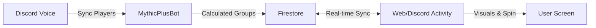

# 🛡️ MythicPlusDiscordBot

[Launch Activity](https://tytaniumdev.github.io/MythicPlusDiscordBot/) | [Documentation](ARCHITECTURE.md) | [Report Bug](https://github.com/tytaniumdev/MythicPlusDiscordBot/issues)

> Effortlessly form balanced Mythic+ groups in World of Warcraft, directly from your Discord voice channel with real-time visualization.

## Hero Visual

## Quick Start

### 🚀 Deployment (CI/CD)
This repo is designed to deploy automatically to a Raspberry Pi via Docker & Tailscale.

1. **Bootstrap**: Follow the steps in `DEPLOYMENT.md`.
2. **Secrets**: Configure GitHub Secrets (see below).
3. **Push**: Commit to `main` to trigger the pipeline.

### 💻 Local Development
1. **Install uv**: `pip install uv` (or `brew install uv`).
2. **Install Dependencies**: `uv sync`.
3. **Run Bot**: `uv run python bot.py`.

## Key Features

- **🎙️ Voice Integration**: Automatically pulls player lists from your current Discord voice channel.
- **⚖️ Smart Balancing**: Algorithmic group creation ensuring every group has a Tank, Healer, and 3 DPS.
- **🎡 Interactive Wheel**: A rich visual "Wheel of Fortune" experience via Discord Activities (or web) to reveal groups.
- **🔥 Real-time Sync**: Powered by Firebase Firestore, the bot and web UI stay perfectly in sync.
- **☁️ Self-Hosted**: Runs entirely on your own infrastructure (Raspberry Pi/Docker) with no external SaaS costs (besides free-tier Firebase).

## Documentation Map

| Document | Purpose | Audience |
|----------|---------|----------|
| [ARCHITECTURE.md](ARCHITECTURE.md) | High-level system design & diagrams | Architects/Devs |
| [DEPLOYMENT.md](DEPLOYMENT.md) | Raspberry Pi & Docker setup guide | DevOps |
| [FIREBASE_SETUP.md](FIREBASE_SETUP.md) | Firestore & Service Account config | DevOps |
| [ACTIVITY_SETUP.md](ACTIVITY_SETUP.md) | Frontend build & host details | Frontend Devs |
| [AGENTS.md](AGENTS.md) | Instructions for AI Agents | Bots 🤖 |

## Configuration (Secrets)

The following secrets are required in GitHub Actions for the deployment pipeline:

- `TS_AUTHKEY`: Tailscale auth key.
- `PI_HOST`, `PI_USER`, `PI_SSH_KEY`: SSH connection details.
- `PI_APP_DIR`: Target directory on the Pi.
- `GHCR_TOKEN`: GitHub PAT for container registry.
- `BOT_TOKEN`: Discord Bot Token.
- `DISCORD_APPLICATION_ID`: App ID for Activity invites.
- `FIREBASE_CREDENTIALS_JSON`: Minified Service Account JSON for Firestore.

## Contributing

We welcome contributions! Please follow these rules:

1. **Agents**: Read `AGENTS.md` strictly.
2. **Verification**: You **MUST** run `./scripts/verify.sh` before submitting any PR. This handles linting (Ruff) and tests.
3. **Style**: We use `ruff` for formatting and linting.

---
*Last Updated: 2024-05-21*
