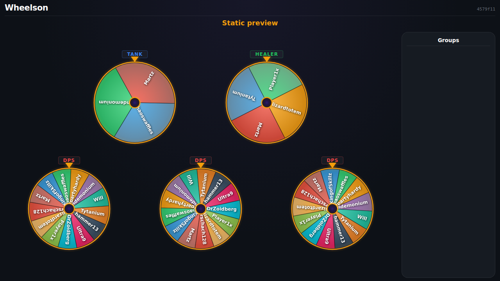

# MythicPlusDiscordBot 💎

[](https://github.com/tytaniumdev/MythicPlusDiscordBot/actions)
[](LICENSE)

### [ 🚀 Launch App ](https://tytaniumdev.github.io/MythicPlusDiscordBot/)  |  [ 📖 Documentation ](#documentation-map)  |  [ 🐞 Report Bug ](https://github.com/tytaniumdev/MythicPlusDiscordBot/issues/new?template=bug_report.md)

> **The "Front Door" for your guild's Mythic+ groups.**
> Seamlessly organize, calculate, and announce Mythic+ groups directly in Discord with interactive activities.

---

## 📸 Preview



## ⚡ Quick Start (Local Development)

Get up and running in less than 5 minutes.

1.  **Clone the repo**
    ```bash
    git clone https://github.com/TytaniumDev/MythicPlusDiscordBot.git
    cd MythicPlusDiscordBot
    ```

2.  **Install Dependencies**
    We recommend using [uv](https://github.com/astral-sh/uv) for fast, reliable dependency management.
    ```bash
    uv sync
    ```

3.  **Configure Environment**
    Create a `.env` file in the root directory:
    ```bash
    echo "BOT_TOKEN=your_token_here" > .env
    ```

4.  **Run the Bot**
    ```bash
    uv run python bot.py
    ```

## ✨ Key Features

*   **⚖️ Balanced Groups**: Automatically calculate optimal Tank/Healer/DPS ratios based on player roles and key levels.
*   **🎡 Interactive Activity**: "Wheel of Fate" for selecting keys or players, integrated directly into Discord voice channels.
*   **🐞 Seamless Feedback**: Report bugs and request features directly to GitHub without leaving Discord.

## 🗺️ Documentation Map <a id="documentation-map"></a>

*   **🏗️ Architecture**: [Read `ARCHITECTURE.md`](./ARCHITECTURE.md) - Understanding the core logic and services.
*   **🚀 Deployment**: [Read `DEPLOYMENT.md`](./DEPLOYMENT.md) - Docker, Raspberry Pi, and GitHub Actions setup.
*   **🎮 Activity Setup**: [Read `ACTIVITY_SETUP.md`](./ACTIVITY_SETUP.md) - Configuring the Discord Activity and Frontend.
*   **🔥 Firebase Setup**: [Read `FIREBASE_SETUP.md`](./FIREBASE_SETUP.md) - Database and Auth configuration.
*   **👨‍💻 Contributing**: [Read `CONTRIBUTING.md`](./CONTRIBUTING.md) - Development standards and guidelines.

## 🤝 Contributing

We welcome contributions! Please check `CONTRIBUTING.md` for development standards and guidelines.

1.  **Install Pre-commit Hooks**
    ```bash
    pre-commit install
    ```
2.  **Verify Changes**
    ```bash
    ./scripts/verify.sh
    ```

---

_Maintained by TytaniumDev_
