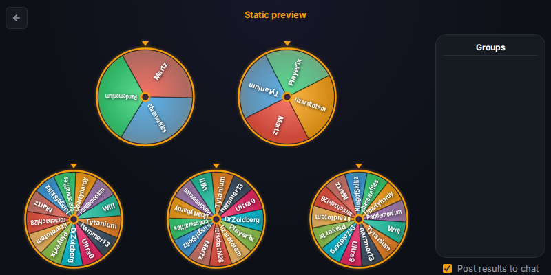

<div align="center">

# MythicPlusDiscordBot 💎

### [ 🚀 Launch App ](https://tytaniumdev.github.io/MythicPlusDiscordBot/)  |  [ 📖 Documentation ](#documentation-map)  |  [ 🐞 Report Bug ](https://github.com/tytaniumdev/MythicPlusDiscordBot/issues/new?template=bug_report.md)

<br/>

[](https://github.com/tytaniumdev/MythicPlusDiscordBot/actions)
[](LICENSE)

</div>

> **The "Front Door" for your guild's Mythic+ groups.**
> Seamlessly organize, calculate, and announce Mythic+ groups directly in Discord with interactive activities.

---

## 📸 Preview



## ⚡ Quick Start (Local Development)

Get up and running in less than 5 minutes.

1.  **Clone the repo**
    ```bash
    git clone https://github.com/TytaniumDev/MythicPlusDiscordBot.git
    cd MythicPlusDiscordBot
    ```

2.  **Install Dependencies**
    This project uses `npm` workspaces and requires system dependencies.
    ```bash
    ./setup.sh
    ```

3.  **Configure Environment**
    Create a `.env` file in the `packages/bot` directory (it MUST be placed here, not the monorepo root, for `dotenv` to work):
    ```bash
    echo "BOT_TOKEN=your_token_here" > packages/bot/.env
    echo "DISCORD_APPLICATION_ID=your_app_id" >> packages/bot/.env
    ```

4.  **Run the Bot**
    ```bash
    npm -w @mythicplus/bot run dev
    ```

## ✨ Key Features

*   **Group Organization**: Automatically calculate balanced Mythic+ groups based on player roles and key levels.
*   **Discord Activity**: Interactive "Wheel of Fate" for selecting keys or players, integrated directly into Discord voice channels.
*   **GitHub Integration**: Report bugs and request features directly from Discord using `/bug` and `/featurerequest`.

## 🗺️ Documentation Map <a id="documentation-map"></a>

*   **🏗️ Architecture**: [Architecture Documentation](./ARCHITECTURE.md) - Understanding the core logic and services.
*   **🚀 Deployment**: [Deployment Guide](./DEPLOYMENT.md) - Docker, Raspberry Pi, and GitHub Actions setup.
*   **🎮 Activity Setup**: [Activity Configuration](./ACTIVITY_SETUP.md) - Configuring the Discord Activity and Frontend.
*   **🔥 Firebase Setup**: [Firebase Configuration](./FIREBASE_SETUP.md) - Database and Auth configuration.
*   **👨‍💻 Contributing**: [Development Standards](./CONTRIBUTING.md) - Development standards and guidelines.
*   **🛡️ CI Standards**: [CI & Security Standards](./docs/CI_STANDARDS.md) - CI and security standards.
*   **🤖 AI Agents**: [Agent Instructions](./AGENTS.md) - Instructions and standards for AI agents.

## 🤝 Contributing

We welcome contributions! Please check the [Contributing Guidelines](./CONTRIBUTING.md) for development standards, guidelines, and verification instructions.

---

_Maintained by TytaniumDev_
